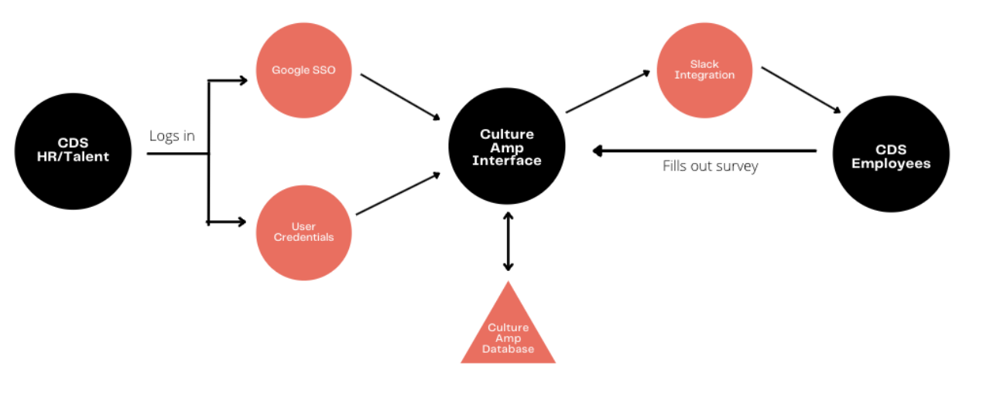

# Culture Amp

## Decision statement/description

Culture Amp ([https://cultureamp.com](https://cultureamp.com)) is the market-leading employee experience platform. Through the deployment of its powerful engagement, onboarding, exit & pulse survey tools, as well as, behavioural change and just-in-time learning material, Culture Amp enables organizations to improve their employee engagement, foster stronger teams, and retain their talent.

The platform’s seamless integration delivers notifications right into the workflow resulting in higher participation rates. Culture Amp empowers people to be honest and frank about what’s working and what’s not. This feedback is crucial to CDS and its quest to continuously iterate for the better.  

The data acquired via Culture Amp’s platform will enable CDS to form educated hypotheses to create solutions around areas that need attention. The use of Culture Amp would drive time and resource-savings by enabling CDS to make smarter decisions around engagement by providing the data CDS needs to better understand burnout, burnout prevention, and employee wellbeing. 

Culture Amp’s applications and supporting services are hosted on modern, Linux based operating systems and built upon modern application development frameworks. All production environments are hosted on Amazon’s AWS cloud platform hosted in either the US or EU.

According to Culture Amp, it helps customers maintain control of their privacy and data security in a myriad of ways:

* Culture Amp undergoes independent testing with industry-leading security firms to perform a regular cadence of penetration tests covering their networks, infrastructure and applications. Culture Amp is [ISO 27001](https://en.wikipedia.org/wiki/ISO/IEC_27001) certified.
* Culture Amp provides standard access to its platform through a login and password. There are minimum character limits imposed upon password creation and lockout safeguards in place. Additionally, Culture Amp offers login via the integration of SSO, utilizing either SAML 2.0 or OAuth.
* Culture Amp’s platform contains multiple layers of security controls which protect access to and from within their environment. This includes firewalls, intrusion detection systems and network segregation. 
* Culture Amp’s Security teams are continuously monitoring security systems, event logs, notifications, and alerts from all systems to identify and manage threats. They are available and on call 24/7 to provide global incident coverage. All customers affected by a breach will be notified within 48 hours of discovery.
* Culture Amp encrypts all data that goes between CDS and Culture Amp using industry-standard TLS 1.2. The data is encrypted at rest when it is stored on Culture Amp’s servers using full disk encryption AES 256, and also, encrypted in transit between Culture Amp and the multi-region data centres used for backups.
* Culture Amp assesses the risk of all new third-party services and systems before adoption in accordance with its own security requirements, including their commercial terms, confidentiality obligations and privacy policies.

This document recommends the use of Culture Amp with Protected A data. See below for relevant data elements, recommendations, and risks.

## Data elements/simplified statement of sensitivity

Key Protected A data elements include the following:

<table>
  <tr>
   <td><strong>Data Element</strong>
   </td>
   <td><strong>Considerations (Confidentiality, Integrity, Availability)</strong>
   </td>
  </tr>
  <tr>
   <td>HR & Talent
   </td>
   <td>
<ul>

<li>Onboarding and offboarding surveys conducted are targeted, these would reveal the following: 
<ul>
 
<li>Name
 
<li>Email address
 
<li>Phone number
</li> 
</ul>

<li>Engagement surveys are set-up in a way that does not allow information to show up as individual-level data. There is no access to raw data, however, voluntarily responding to questions pertaining to diversity, equity and inclusion may uncover the participant’s identity.

<li>Failure to maintain confidentiality of this information could cause psychological harm to people (stress), if their information was inadvertently disclosed. This is particularly true for candidates who have disclosed unfavourable feedback to CDS. The expected injury significance is likely to be <strong>low</strong>. 
<ul>
 
<li><strong>Note: information related to staff performance, disciplinary measures or complaints is considered Protected B and is not in scope for this ATO.</strong>
</li> 
</ul>

<li>Failure to maintain integrity of this information (for example, candidate information being inadvertently lost) could cause psychological harm to people (stress) as well as risk of lost employment opportunities. This is partly mitigated by other information systems (for example, Lever HR, TBS Exchange email, etc.). Expected injury significance is likely to be <strong>low</strong>.

<li>Failure to maintain the availability of this information (for example, Culture Amp being temporarily unavailable) would have similar harms. As above, other information systems partly mitigate this. Expected injury significance is likewise likely to be <strong>low</strong>.
</li>
</ul>
   </td>
  </tr>
</table>

## System diagram

## Recommendations

As part of using Culture Amp with Protected A information, the following security measure are recommended:

1. Use Google SSO (rather than standalone Culture Amp user accounts) in order to secure access to the Culture Amp system. This adds multi-factor authentication and harmonized user management with CDS’s overall staff account management.
2. Ensure that at least two CDS staff have full administrative / super-admin access to the Culture Amp system at all times, for business continuity reasons.
3. Ensure that principles of least privilege are applied and that only designated staff are able to view survey results that pertain to their work.
4. Ensure that, if Culture Amp is replaced with an alternative product or that CDS decides to stop using it, that the CDS Culture Amp account is formally terminated and that the data contained within the system is deleted.

## Impact/risks

* No Canadian datacenter – Protected data would reside either in Ireland or Oregon. Although this is now permitted under the [Directive on Service and Digital](https://www.tbs-sct.gc.ca/pol/doc-eng.aspx?id=32601), and the technical safeguards would be the same irregardless of the location of data, there are questions around the appearance of protected data being stored outside Canada. Based on the fact that Culture Amp has a valid ISO 27001 certification, provides full customer control of data and backups, as well as automatic backup deletion, we do not expect this to become a problem if restrictions on hosting protected data outside of Canada are re-introduced in the future. The residual risk is **low**.
* The application is a multi-tenant application. There is no logical isolation of customer data on the infrastructure level - instead application level controls are used. This is common with Software as a Service. The risk of having data shared with other customers is low assuming the application is architected properly. Based on their development practices and business model, we would assume this to be the case. The residual risk is **low**.