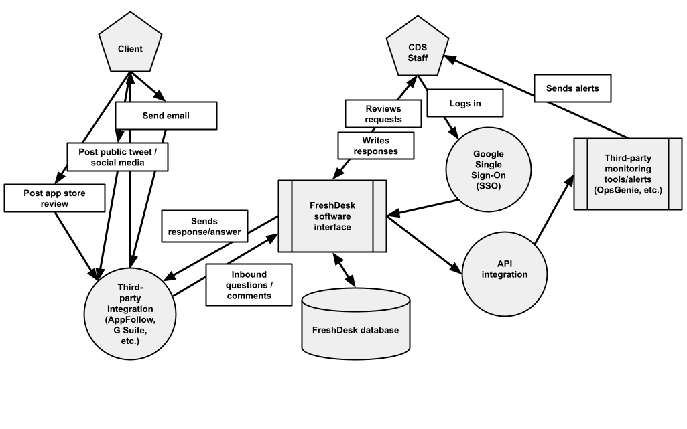

# Authority to Operate for internal tools: FreshDesk + integrations

## Decision statement/description

FreshDesk ([https://freshdesk.com/](https://freshdesk.com/)) is an online software-as-a-service tool to support organizations’ customer support processes. It includes a support request intake and ticketing system, a mechanism for publishing and searching for support articles, and other features to help support and technical staff respond to client requests.

FreshDesk was originally test-run at CDS to support GC Notify’s client support methods (as part of Service Reliability Engineering work). Initially, it was only used to support requests from other GC public servants who were using GC Notify. However, it has since proven useful enough to adopt for other CDS support processes, particularly COVID Alert. For COVID Alert, FreshDesk is used by CDS’s support team as they triage requests that are received via Health Canada’s front-line support processes (call centre and email inbox).

FreshDesk provides a number of features that led to it being selected by the SRE team. The main requirements were something that was bilingual, easy to use, supported an information portal with multiple “products”, was able to create automations, was able to link to many other tools with an API (for example, integration with APPFollow and OpsGenie), and the ability to have “occasional” accounts for folks in management to be able to check in without it costing a full account. The range of products supported by SRE (and CDS more broadly) added the required ability to have different “groups” of users, different notification parameters, business hours and business days rules, based on each product. The customer support tool also needed to support Google Authentication for SSO, and needed to be very easy to integrate into CDS’s products (API’s and other products).

FreshDesk is a widely used customer support CRM product. It has a [SOC 2 Type 2 independent review](https://www.freshworks.com/security/resources/). FreshDesk data is hosted on Amazon Web Services. It includes the [following security considerations](https://support.freshdesk.com/support/solutions/articles/196893-data-storage-and-data-security-in-freshdesk-):

* Freshworks uses a multi-tenant data model to host all its applications. Per this design, no customer has access to another customer’s data.
* All data at rest is encrypted using AES-256-bit standards with the keys being managed by AWS Key Management Service. All data in transit is encrypted using FIPS-140-2 standard encryption.
* All the events and activities are logged and monitored on a monthly basis. Application Audit Logs within the Admin console captures the user activities and configuration changes or all agents. These logs are read-only and also encrypted for protection.
* By default, Freshdesk does not have access to any of the customer's data. In case a customer wants a Freshdesk representative to work on their account, they have to add them as an occasional agent. 
* When accounts are deleted, any data deleted will be erased 14 days post date of termination.

This document recommends the use of FreshDesk with Protected A data. See below for relevant data elements, recommendations, and risks.

### Integrations with other third-party platforms used by CDS

* APPfollow (public reviews from Google Play Store and Apple App Store reviews)
* OpsGenie (on-call alerting and incident response tool)
* Slack (team communication tool)
* G Suite (inbound and outbound email handling)

## Data elements/simplified statement of sensitivity

<table>
  <tr>
   <td><strong>Data element</strong>
   </td>
   <td><strong>Considerations (confidentiality, integrity, availability)</strong>
   </td>
  </tr>
  <tr>
   <td><strong>Client contact information</strong>
   </td>
   <td>
<ul>

<li>Client contact information stored in FreshDesk generally consists of the following: 
<ul>
 
<li>Name
 
<li>Email address
 
<li>Phone number (optional, if supplied)
</li> 
</ul>

<li>This contact information can originate either from public servants (public information) or from members of the public (personally-identifying information). 

<li>Failure to maintain confidentiality of client contact information could cause psychological harm to people (stress), if their information was inadvertently disclosed. The expected injury significance is likely to be <strong>low</strong>.

<li>Failure to maintain the integrity of client contact information (for example, not being able to match ticket request content with the correct client) would have similar harms, also with an expected injury significance that is likely to be <strong>low</strong>.

<li>Failure to maintain the availability of the information (for example, FreshDesk being temporarily unavailable) would have similar harms, as clients would have to wait until the system returns online for CDS support staff to be able to respond. Other mechanisms could be used in the interim (for example, TBS email, partner support from Health Canada support colleagues, etc.). The expected injury significance is also <strong>low</strong>.
</li>
</ul>
   </td>
  </tr>
  <tr>
   <td><strong>Client support ticket content</strong>
   </td>
   <td>
<ul>

<li>Client support ticket content is information submitted by clients as part of their support request (for example, describing their technical issue or providing feedback on the usability or functionality of a product or service).

<li>Failure to maintain confidentiality of client support ticket content could cause psychological harm to people (stress), if their technical issue or feedback was inadvertently disclosed. The expected injury significance is likely to be <strong>low</strong>. 
<ul>
 
<li>In cases where clients submit support requests that include more sensitive personal information (for example, positive COVID diagnoses or test results), a <a href="https://docs.google.com/document/d/14b8KkaaDKi4PXkQkqmekuLeZGGZd3NNdtpzzeEcrFoM/edit">separate process applies that uses TBS Protected B email</a> (internal).
</li> 
</ul>

<li>Integrity and availability considerations for client support ticket content are the same as client contact information above, also <strong>low</strong> and <strong>low</strong>, respectively.
</li>
</ul>
   </td>
  </tr>
  <tr>
   <td><strong>Helpdesk Q&A guides</strong>
   </td>
   <td>
<ul>

<li>Helpdesk Q&A guides (standard responses to technical questions stored in FreshDesk) are public information, and can be accessed without signing into the FreshDesk platform. These guides may be based on questions asked via client support ticket content, but do not include specific requests or client contact information.

<li>Because these guides are public information, confidentiality, integrity, and availability failure risks are <strong>N/A</strong>, <strong>N/A</strong>, <strong>N/A</strong>.
</li>
</ul>
   </td>
  </tr>
</table>

Cumulatively, the security categorization of these data elements is considered **Protected A**, “information when unauthorized disclosure could reasonably be expected to cause limited or moderate injury outside the national interest, for example, disclosure of an exact salary figure.”

## System diagram

## Recommendations

As part of using FreshDesk with Protected A information, the following security measure are recommended:

1. Use Google SSO (rather than standalone FreshDesk user accounts) in order to secure access to the FreshDesk system. This adds multi-factor authentication and harmonized user management with CDS’s overall staff account management.
2. Ensure that at least two CDS staff have full administrative / super-admin access to the FreshDesk system at all times, for business continuity reasons.
3. Ensure that, if FreshDesk is replaced with an alternative product or that CDS decides to stop using it, that the CDS FreshDesk account is formally terminated and that the data contained within the system is deleted.

## Impact/risks

Adopting a customer support CRM tool, like FreshDesk, helps manage inbound requests across a multiple-person support team. It allows triaging across a support team, coordinating responses to messages and identifying outstanding versus completed tickets, and analysing response times and prioritizing or tagging tickets for follow-up. 

The following risks remain, when adopting FreshDesk for Protected A information even with the recommendations above implemented:

* If FreshDesk (or CDS’s implementation of it) goes temporarily offline, clients could receive delayed responses. Clients who sent these requests may not be notified of the delay, and CDS may not realize that a request was delayed. This risk can be partially mitigated by monitoring other CDS communication channels (for example, CDS official social media) for signs of complaints that support requests were not responded to in a timely manner. The residual risk is **low**.
* Information could be submitted to FreshDesk from external sources (e.g. customers sending in support emails) that includes higher-sensitivity information (for example, Protected B health information). In this case, care should be taken to expunge this information within a specified timeframe (e.g. less than 5 business days). [A documented process for CDS support team staff to follow is located here](https://docs.google.com/document/d/1QOfcnTADZOMzS9DDNIIXjoxHO2SluKgnuhNuWv9Oulo/edit) (internal). CDS staff using FreshDesk and related tools should be informed on information classification levels and able to identify cases where this takes place, and respond accordingly. Residual risk (of Protected B information being submitted from external sources into FreshDesk) is **medium**.
* FreshDesk has integration features with many widely-used alerting or notification systems. Ensuring that these third-party integrations do not indefinitely retain data is important to ensure that Protected A data is not left in these systems, particularly if FreshDesk use by CDS is ended down the road. Before connecting a new integration, it should be reviewed to ensure that data is only retained for a limited time (either by default or via a configuration setting), for example for 1 year or less. Residual risk of third-party integrations is **medium**.
