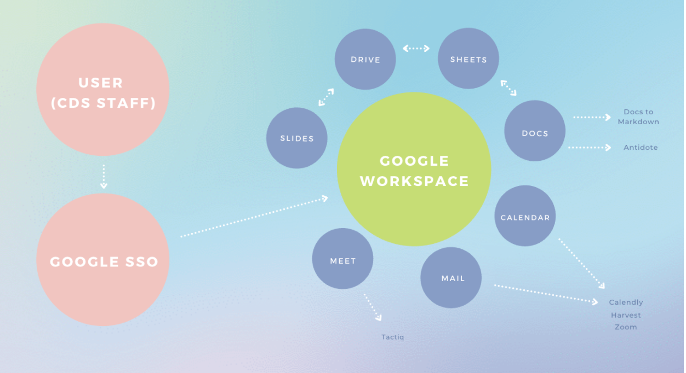

# Google Workspace + integrations (Draft - Approval required)

## Decision statement/description

Google Workspace ([https://workspace.google.com/](https://workspace.google.com/)) is a set of team collaboration and productivity tools that are provided by Google under a software-as-a-service delivery model. Formerly called Google Suite or “G Suite”, Google Workspace includes several connected services including: 

* Google Docs, Sheets, and Presentations and Google Drive for collaborative, real-time document editing
* Google Forms for easy-to-use data collection
* Google Meet for team videoconferencing
* Google Mail, Groups, and Calendar for team communications

All of these services are accessed by a centralized login and account management system, administered at an organizational level. These services are comparable to, but operated separately from, Google’s consumer products. Google Workspace products [do not include the advertising and ad-related data collection](https://storage.googleapis.com/gfw-touched-accounts-pdfs/google-cloud-security-and-compliance-whitepaper.pdf) included in Google’s consumer products.

CDS adopted Google Workspace in late 2017, for use with unclassified data. Google Workspace is widely used in the technology industry for team collaboration, in particular given the collaborative, real-time editing features in Google Docs, Sheets, and Presentations. Using Google Workspace directly supported CDS’s efforts to recruit design and software development talent from the technology industry, as well as to ensure that staff could collaborate as quickly and effectively as possible. Google Workspace is the tool of choice for many leading software and design companies. Google Workspace is also multilingual (supporting English and French user interfaces) and supports integrations with a wide variety of other technology products used by CDS staff.

As CDS moved towards a distributed-first model (beginning pre-COVID but continuing to accelerate through the pandemic), the use of Google Workspace has helped staff collaborate and communicate effectively. Google Workspace and related tools allowed CDS to minimize its impact and dependency on limited VPN resources, at the outset of the pandemic, freeing the use of these up for other departmental employees.

As of 2021, Google Workspace is available via the SSC Cloud Brokering Service process. CDS currently procures Google Workspace via this SSC vehicle.

Moving from unclassified-only to Protected A information will allow Google Workspace to be used with types of information that were previously not available. [Previous internal CDS ATO processes](https://drive.google.com/file/d/1uSmqx4_tQGJE6WcCviXvJILUfp5A38xr/view?usp=sharing) have authorized the use of Google Workspace for HR and talent recruitment-related information; this internal ATO broadens that scope to all Protected A data.

Google Workspace includes [a number of key security measures](https://storage.googleapis.com/gfw-touched-accounts-pdfs/google-cloud-security-and-compliance-whitepaper.pdf), and it is widely used by prominent technology companies. These security measures include:

* Industry-leading access and authentication systems, based on Google’s “BeyondCorp” security approach and including the use of hardware-based multi-factor authentication keys (Yubikeys), single sign-on systems, phishing protections, and monitoring tools
* Robust spam protection and malware detection systems, as well as spoofing alerts, unintended external reply warnings, and other user protections
* Administrator audit logging capabilities across the range of Google Workspace services, including configurable email alerts of administrator activity (e.g. adding, suspending, and deleting users)
* Anti-hijacking and anti-abuse features for Google Meet
* Encryption in transit and encryption at rest for Google Workspace consumer data
* Role-based access controls that can be implemented in Google Drive thereby limiting/restricting access to certain users and groups

Google hosts Google Workspace in their own data centres worldwide, designed to provide geographic redundancy and high levels of security. Google Workspace and the infrastructure it runs on [is certified to meet](https://workspace.google.com/security/#compliance) ISO 27001, SOC 2 and SOC 3, and FedRAMP requirements.

Google’s internal security teams are recognized as industry leading; Google’s Project Zero team [identifies and works to mitigate threats](https://www.google.com/about/appsecurity/) in widely-used products from both Google and its competitors.

### Integrations with other third-party platforms used by CDS

Additional integrations may be added over time; the Google Workspace Admin console provides a canonical list:

* Google Drive integrations (including Google Docs, Sheets, and Presentations)
    * Slack
    * Trello
    * Antidotes
* Google Docs add-ons
    * Docs to Markdown
    * Antidote
* Google Mail and Calendar
    * Calendly
    * Harvest
    * Zoom
* Google Meet
    * Tactiq

In addition to the above, CDS also uses Google single-sign on (SSO) to log in to a variety of third-party services (without providing access into Google Workspace data from these services).

## Data elements/simplified statement of sensitivity

Key Protected A data elements include the following:

<table>
  <tr>
   <td><strong>Data element</strong>
   </td>
   <td><strong>Considerations (confidentiality, integrity, availability)</strong>
   </td>
  </tr>
  <tr>
   <td><strong>HR and talent recruitment</strong>
   </td>
   <td>
<ul>

<li>HR and talent recruitment information stored in Google Workspace may include the following: 
<ul>
 
<li>Name
 
<li>Email address
 
<li>Phone number
 
<li>Résumés or CVs submitted by candidates
 
<li>Interview notes
</li> 
</ul>

<li>This information is generally submitted by candidates (via the Lever HR Applicant Tracking System) and/or is updated by Talent team staff. CDS’s use of Lever HR is authorized in a separate ATO.

<li>Failure to maintain confidentiality of this information could cause psychological harm to people (stress), if their information was inadvertently disclosed. This is particularly true for candidates who have not informed their current employer of their interest in joining CDS. The expected injury significance is likely to be <strong>medium</strong>. 
<ul>
 
<li><strong>Note: information related to staff performance, disciplinary measures or complaints is considered Protected B and is not in scope for this ATO.</strong>
</li> 
</ul>

<li>Failure to maintain integrity of this information (for example, candidate information being inadvertently lost) could cause psychological harm to people (stress) as well as risk of lost employment opportunities. This is partly mitigated by other information systems (for example, Lever HR, TBS Exchange email, etc.). Expected injury significance is likely to be <strong>low</strong>.

<li>Failure to maintain the availability of this information (for example, Google Workspace being temporarily unavailable) would have similar harms. As above, other information systems partly mitigate this. Expected injury significance is likewise likely to be <strong>low</strong>.
</li>
</ul>
   </td>
  </tr>
  <tr>
   <td><strong>Design research participant information and session notes</strong>
   </td>
   <td>
<ul>

<li>Design research information stored in Google Workspace may include the following: 
<ul>
 
<li>Name
 
<li>Email address
 
<li>Phone number
 
<li>Participant consent information
 
<li>Interview or usability test session notes
 
<li>Research plans including participant or viewer safety protocols
</li> 
</ul>

<li>This information is submitted by research participants in response to public (e.g. via CDS social media) or private (e.g. via external organizations or communities) participant call-outs, and/or is updated by CDS design research staff.

<li>Failure to maintain confidentiality of this information could cause psychological harm to people (stress), if their contact information or design research comments and feedback were inadvertently disclosed. For research participants in specific domains (recipients of disability support programs, Veterans, etc.), disclosure of their participation in related design research activities could increase this harm. The expected injury significance is likely to be <strong>medium</strong>. 
<ul>
 
<li><strong>Note: Health-related information related to an individual originating from participants is considered Protected B and is not in scope for this ATO.</strong>
</li> 
</ul>

<li>Integrity and availability considerations for design research information are the same as for HR and talent recruitment information above, also <strong>low</strong> and <strong>low</strong>, respectively.
</li>
</ul>
   </td>
  </tr>
  <tr>
   <td><strong>Unannounced program information and communications</strong>
   </td>
   <td>
<ul>

<li>Unannounced program information and communications stored in Google Workspace are generally related to partnership or platform work that has not yet been publicly announced. For example: decisions to launch or phase out a platform service or a partnership with a federal department, or roll out significant changes to services that CDS builds or advises on. 
<ul>
 
<li>This information may also include activities, information, or requests from other jurisdictions (for example, provincial and territorial counterparts, municipalities, organizations, and/or other countries).
</li> 
</ul>

<li>Failure to maintain confidentiality of this information could cause embarrassment for CDS and its partner organizations. The expected injury significance is likely to be <strong>low</strong>. 
<ul>
 
<li><strong>Note: Cabinet decisions and advice to ministers is considered Protected B and is not in scope for this ATO.</strong>
</li> 
</ul>

<li>Integrity and availability considerations for this information are comparable to the other categories above, also <strong>low</strong> and <strong>low</strong>, respectively.
</li>
</ul>
   </td>
  </tr>
  <tr>
   <td><strong>Communications and requests from the public</strong>
   </td>
   <td>
<ul>

<li>Communications and requests from the public stored in Google Workspace may include the following: 
<ul>
 
<li>Name
 
<li>Email
 
<li>Phone number
</li> 
</ul>

<li>Failure to maintain confidentiality of this information could cause psychological harm to people (stress), if their request or contact information was inadvertently disclosed. The expected injury significance is likely to be <strong>low</strong>.

<li>Integrity and availability considerations for this information are comparable to the other categories above, also <strong>low</strong> and <strong>low</strong>, respectively.
</li>
</ul>
   </td>
  </tr>
</table>

## System diagram

## Recommendations

As part of using Google Workspace and related integrations with Protected A information, the following security measures are recommended:

1. Continue the use of mandatory hardware-backed 2-factor authentication (Yubikeys) for all CDS staff and admin accounts.
2. Ensure that departing CDS employees, partners, or contractors with Google Workspace accounts have their accounts suspended within a short, predetermined time period following their departure.
3. Use standalone admin accounts to ensure the separation of admin capabilities from daily-use staff accounts.
4. Produce a short guide for CDS employees detailing what information can be stored on Google Workspace and related integrations, and what information (for example, the Protected B information described in the “Data elements” section) must continue to remain outside of Google Workspace. This guide should also indicate what steps to follow if Protected B information is inadvertently transferred into Google Workspace (for example, deleting/removing it within 5 business days, and ensuring that it is also removed from any connected integrations).

## Impact/risks

Use of Google Workspace improves CDS’s ability to collaborate in real-time across a geographically distributed team. Google Workspace also contributes to employee attraction and retention, particularly among digital practitioners being recruited from the private sector, where it is widely used. Google Workspace’s integration capabilities (and the use of the integrations described above) also contribute to CDS employees’ productivity and effectiveness.

The following risks remain, when adopting Google Workspace and integrations for Protected A information even with the recommendations above implemented:

* If external Google accounts (not managed by CDS) of partners, TBS colleagues outside of CDS, contractors, or inter-jurisdictional counterparts are compromised, this could put information that they have been granted to within CDS’s Google Workspace account at risk. This risk can be partly mitigated by limiting the scope of access that external accounts are granted (for example, specific files and folders instead of full “Team Drives”). Where CDS partners or counterparts have organizational Google Workspace accounts, these should be used whenever feasible instead of standalone (consumer) Google accounts. Documents that contain Protected A information should be marked as such (per recommendation 4 above), and access to this information should only be granted to external accounts where it is clearly appropriate to do so. Residual risk of external accounts being compromised is **medium**.
* If third-party integrations with access to CDS’s Google Workspace are compromised, this could put information within Google Workspace at risk. Where possible, ensuring that these integrations only store data for a limited period of time (for example, 1-year retention periods) can reduce this risk. CDS admin staff should monitor notices from the Canadian Centre for Cyber Security, the US’s CISA, the UK’s NCSC and other security organizations, as well as Google, for updates on security issues that might affect Google Workspace or services with third-party integrations to it. As a standard practice, CDS employees should access third-party services that can connect to Google Workspace by using Google SSO rather than one-off logins for these services, to reduce the risk of standalone accounts being compromised. If necessary in the future, CDS could adopt [an allow-list approach to third-party integrations](https://support.google.com/a/answer/7281227) using Google Workspace Admin settings. Residual risk of third-party integrations is **medium**.