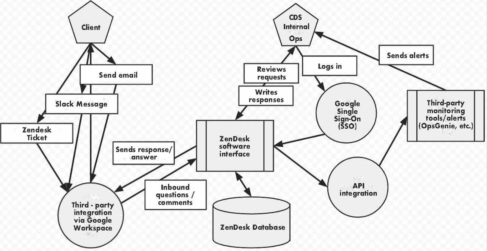

# Authority to Operate for internal tools: Zendesk

## Decision statement/description

Zendesk (https://zendesk.com/) is an online software-as-a-service tool to support organizations’ customer support processes. It includes a support request intake and ticketing system, a mechanism for publishing and searching for support articles, and other features to help support and technical staff respond to client requests. It also includes functionality to track potential future customers for an organization and their needs.

Zendesk is a widely used customer support CRM product. It has a [SOC 2 Type 2 independent review](https://d16cvnquvjw7pr.cloudfront.net/resources/data_sheets/zendesk_security_onepager_02jm.pdf). In addition it is [FEDRamp authorized](https://www.zendesk.com/blog/zendesk-fedramp-authorized/). 

According to Zendesk, it helps customers maintain control of their privacy and data security in a myriad of ways:

* Zendesk provides customers compliance with high security standards, such as encryption of data in motion over public networks, auditing standards (SOC 2, ISO 27001, ISO 27018), Distributed Denial of Service (“DDoS”) mitigations, and a Support team that is on-call 24/7.

* Zendesk only discloses Service Data to third parties where disclosure is necessary to provide the services or as required to respond to lawful requests from public authorities. To that end Zendesk issues a [Transparency report](https://www.zendesk.com/company/privacy-and-data-protection/#transparency-report).

* Zendesk has developed security protections and control processes to help our customers ensure a secure environment for their information. Independent third-party experts have confirmed Zendesk’s adherence to high industry standards.

* Customers who purchase the Data Center Location Deployed Associated Service (“Data Center Location Add-on”) have the ability to select the region (from the available Zendesk regional options) where the data center which hosts their Service Data is located.

* Zendesk provides an advanced set of access and encryption features to help customers effectively protect their information. Zendesk does not access or use customer content for any purpose other than providing, maintaining and improving the Zendesk services and as otherwise required by law.

This document recommends the use of Zendesk with Protected A data. See below for relevant data elements, recommendations, and risks.

## Data elements/simplified statement of sensitivity

<table>
  <tr>
   <td><strong>Data element</strong>
   </td>
   <td><strong>Considerations (confidentiality, integrity, availability)</strong>
   </td>
  </tr>
  <tr>
   <td><strong>Client contact information</strong>
   </td>
   <td>
<ul>

<li>Client contact information stored in Zendesk generally consists of the following: 
<ul>
 
<li>Name
 
<li>Email address
 
<li>Phone number (optional, if supplied)
</li> 
</ul>

<li>This contact information can originate either from public servants (public information) or from members of the public (personally-identifying information). 

<li>Failure to maintain confidentiality of client contact information could cause psychological harm to people (stress), if their information was inadvertently disclosed. The expected injury significance is likely to be <strong>low</strong>.

<li>Failure to maintain the integrity of client contact information (for example, not being able to match ticket request content with the correct client) would have similar harms, also with an expected injury significance that is likely to be <strong>low</strong>.

<li>Failure to maintain the availability of the information (for example, Zendesk being temporarily unavailable) would have similar harms, as clients would have to wait until the system returns online for CDS support staff to be able to respond. Other mechanisms could be used in the interim (for example, TBS email, partner support from Health Canada support colleagues, etc.). The expected injury significance is also <strong>low</strong>.
</li>
</ul>
   </td>
  </tr>
  <tr>
   <td><strong>Client support ticket content</strong>
   </td>
   <td>
<ul>

<li>Client support ticket content is information submitted by clients as part of their support request (for example, describing their technical issue or providing feedback on the usability or functionality of a product or service).

<li>Failure to maintain confidentiality of client support ticket content could cause psychological harm to people (stress), if their technical issue or feedback was inadvertently disclosed. The expected injury significance is likely to be <strong>low</strong>. 
<ul>
 
<li>In cases where clients submit support requests that include more sensitive personal information, a <a href="https://docs.google.com/document/d/14b8KkaaDKi4PXkQkqmekuLeZGGZd3NNdtpzzeEcrFoM/edit">separate process applies that uses TBS Protected B email</a> (internal).
</li> 
</ul>

<li>Integrity and availability considerations for client support ticket content are the same as client contact information above, also <strong>low</strong> and <strong>low</strong>, respectively.
</li>
</ul>
   </td>
  </tr>
  <tr>
   <td><strong>Helpdesk Q&A guides</strong>
   </td>
   <td>
<ul>

<li>Helpdesk Q&A guides (standard responses to technical questions stored in Zendesk) are public information, and can be accessed without signing into the Zendesk platform. These guides may be based on questions asked via client support ticket content, but do not include specific requests or client contact information.

<li>Because these guides are public information, confidentiality, integrity, and availability failure risks are <strong>N/A</strong>, <strong>N/A</strong>, <strong>N/A</strong>.
</li>
</ul>
   </td>
  </tr>
</table>

## System diagram

## Recommendations

As part of using Zendesk with Protected A information, the following security measure are recommended:

1. Use Google SSO (rather than standalone Zendesk user accounts) in order to secure access to the Zendesk system. This adds multi-factor authentication and harmonized user management with CDS’s overall staff account management.
2. Ensure that at least two CDS staff have full administrative / super-admin access to the Zendesk system at all times, for business continuity reasons.
3. Ensure that, if Zendesk is replaced with an alternative product or that CDS decides to stop using it, that the CDS Zendesk account is formally terminated and that the data contained within the system is deleted.

## Impact/risks

Adopting a customer support CRM tool, like Zendesk, helps manage inbound requests across a multiple-person support team. It allows triaging across a support team, coordinating responses to messages and identifying outstanding versus completed tickets, and analysing response times and prioritizing or tagging tickets for follow-up. 

The following risks remain, when adopting Zendesk for Protected A information even with the recommendations above implemented:

* If Zendesk (or CDS’s implementation of it) goes temporarily offline, clients could receive delayed responses. Clients who sent these requests may not be notified of the delay, and CDS may not realize that a request was delayed. This risk can be partially mitigated by monitoring other CDS communication channels (for example, CDS official social media) for signs of complaints that support requests were not responded to in a timely manner. The residual risk is **low**.
* Information could be submitted to Zendesk from external sources (e.g. customers sending in support emails) that includes higher-sensitivity information (for example, Protected B health information). In this case, care should be taken to expunge this information within a specified timeframe (e.g. less than 5 business days). [A documented process for CDS support team staff to follow is located here](https://docs.google.com/document/d/1QOfcnTADZOMzS9DDNIIXjoxHO2SluKgnuhNuWv9Oulo/edit). CDS staff using Zendesk and related tools should be informed on information classification levels and able to identify cases where this takes place, and respond accordingly. Residual risk (of Protected B information being submitted from external sources into Zendesk) is **medium**.
* Zendesk has integration features with many widely-used alerting or notification systems. Ensuring that these third-party integrations do not indefinitely retain data is important to ensure that Protected A data is not left in these systems, particularly if Zendesk use by CDS is ended down the road. Before connecting a new integration, it should be reviewed to ensure that data is only retained for a limited time (either by default or via a configuration setting), for example for 1 year or less. Residual risk of third-party integrations is **medium**.